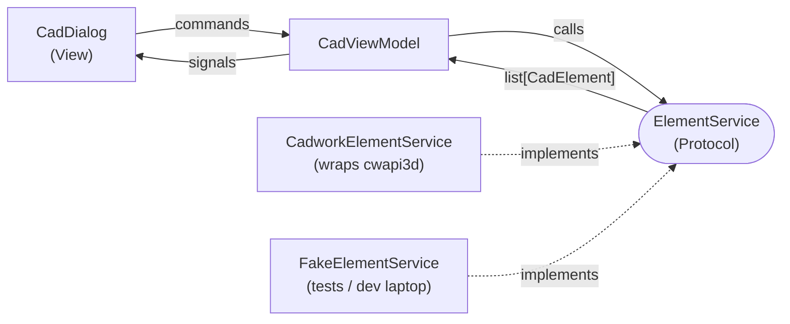

# CadDialog — PyQt6 MVVM reference for cwapi3d

A minimal, clean example of how to build a PyQt6 dialog for cadwork 3d v2026 (use PyQt5 for v2025 and below)
using the Model–View–ViewModel pattern. It lists the currently active
elements in cadwork and shows their name, type, and vertex count.
Selecting a row sets those elements active in cadwork.

The point of the repo is not the feature. It's the **shape**: where
cwapi3d calls live, how the UI stays free of business logic, and how
the whole thing is testable without cadwork installed.

## Architecture



Folder layout mirrors the three MVVM layers — dependency arrows always
point inward (`ui/` → `models/`, `services/` → `models/`, never the reverse):

```
CadDialog/
  CadDialog.py                           # entry point (plugin + standalone)
  models/                                # domain layer — depends on nothing
    cad_element.py                       #   @dataclass entity
    element_service.py                   #   ElementService Protocol (contract)
  services/                              # infrastructure — implementations
    cadwork_element_service.py           #   the cwapi3d adapter (only file importing cwapi3d)
    fake_element_service.py              #   dev/test stand-in
  ui/                                    # presentation layer
    cad_dialog.py                        #   View
    cad_dialog.ui                        #   Qt Designer layout
    cad_view_model.py                    #   ViewModel (state + signals + commands)
  tests/
    test_cad_view_model.py
  README.md
  requirements.txt
```

- **Model** — [models/cad_element.py](models/cad_element.py) + [models/element_service.py](models/element_service.py):
  the domain vocabulary. `CadElement` is a frozen `@dataclass`;
  `ElementService` is a `Protocol` — the contract the ViewModel depends on.
- **Services** — [services/cadwork_element_service.py](services/cadwork_element_service.py) + [services/fake_element_service.py](services/fake_element_service.py):
  two concrete implementations of `ElementService`. The cadwork adapter
  is the only file in the whole project that imports cwapi3d.
- **ViewModel** — [ui/cad_view_model.py](ui/cad_view_model.py): holds
  `elements` and `is_loading` state, exposes `load_elements()` and
  `activate_elements()` as commands, emits `elementsChanged` / `loadingChanged` / `errorOccurred`.
  No Qt widgets imported here — which is why it is unit-testable.
- **View** — [ui/cad_dialog.py](ui/cad_dialog.py) + [ui/cad_dialog.ui](ui/cad_dialog.ui):
  the `QDialog`. Loads the `.ui` file, forwards button clicks and row
  selection to ViewModel commands, re-renders on ViewModel signals.
  No cwapi3d imports here, no `CadElement` construction here.

## Running

### Inside cadwork 3d (plugin)

cadwork owns the Qt event loop, so don't create a `QApplication`:

```python
from CadDialog import run_plugin
dialog = run_plugin()
```

### Standalone (dev laptop, no cadwork)

```
pip install -r requirements.txt
python CadDialog.py
```

Uses `FakeElementService`, so you can iterate on the UI without a
cadwork install.

### Tests

```
pip install -r requirements.txt
pytest
```

The tests drive `CadViewModel` with a fake service and with a service
that raises — no widgets, no cadwork, no event loop.

## Adding a new cwapi3d feature

Follow the arrows, never skip a layer:

1. Add a method to the `ElementService` Protocol in
   [models/element_service.py](models/element_service.py).
2. Implement it in [services/cadwork_element_service.py](services/cadwork_element_service.py)
   (real cwapi3d calls) and in [services/fake_element_service.py](services/fake_element_service.py)
   (canned data for dev/tests).
3. Add a command method and any new state/signals on
   [ui/cad_view_model.py](ui/cad_view_model.py).
4. Bind the command and signals in
   [ui/cad_dialog.py](ui/cad_dialog.py).
5. Add a test in [tests/](tests/) using a fake service.

If a step feels awkward, it's usually a signal that a layer is doing
the wrong job — resist the temptation to take a shortcut through it.
